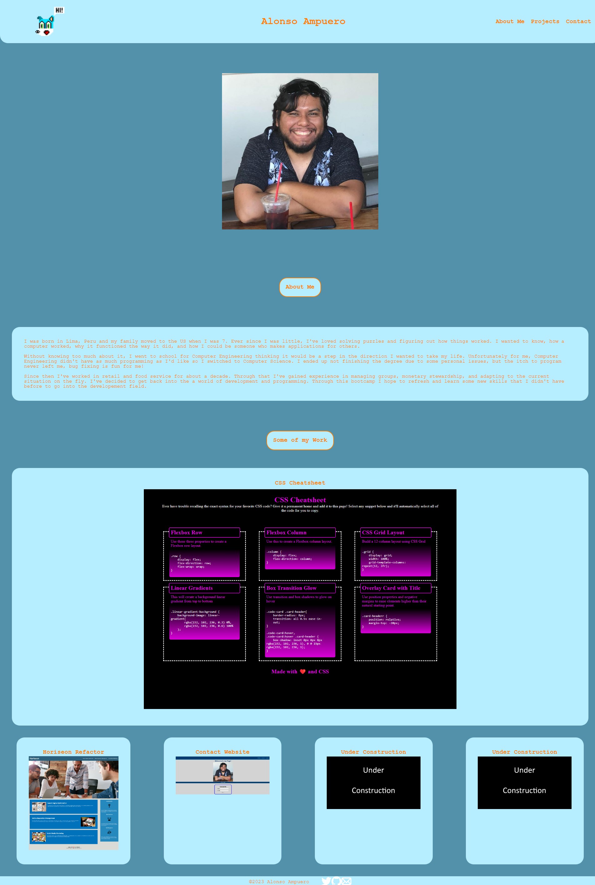
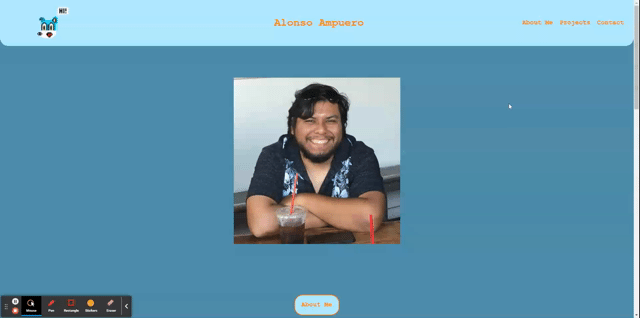

# My Portfolio

## Description

The goal of this project is to create a place to show off some of the work I've done and acccomplished. It will be updated in both style and content as time on goes on. Through it I've gained a better understanding of styling in CSS, the use of nested objects, and flexbox manipulation.

[Deployed Website](https://fenriragni.github.io/pro-portfolio/)

## Usage
Clicking on one of the Navigation Links takes you to the corresponding section on the site.
 
Clicking on any of the project images takes you to the deployed website. 
 
Hovering over a section hightlights it.
 

## Credits 
Thanks to [Janet/TwixmixyJanet](https://github.com/TwixmixyJanet) for giving the project a once over and pointing out some things I forgot about. Also for the tip abouve WAVE!

[Github Logo](https://github.com/logos)  
[Twitter Logo](https://www.iconsdb.com/white-icons/twitter-icon.html)  
[e-mail Icon](https://www.iconsdb.com/white-icons/mail-icon.html)